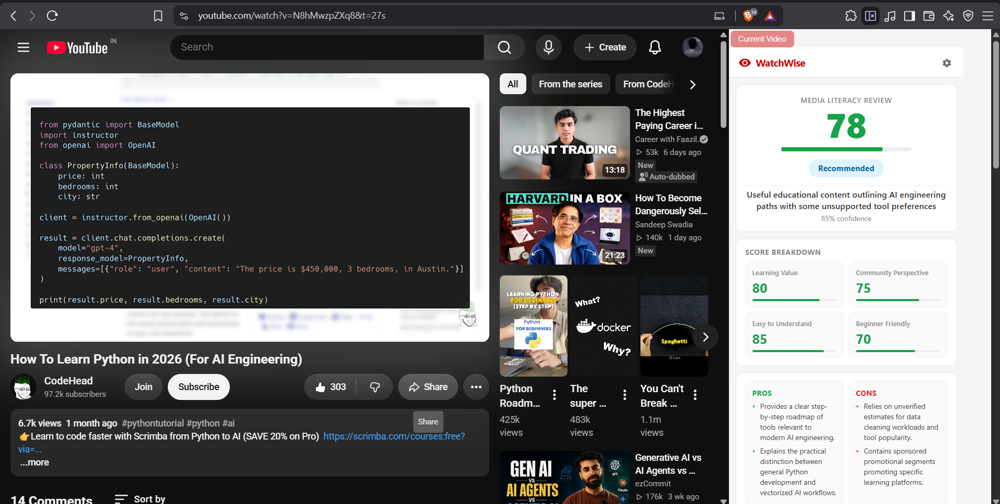
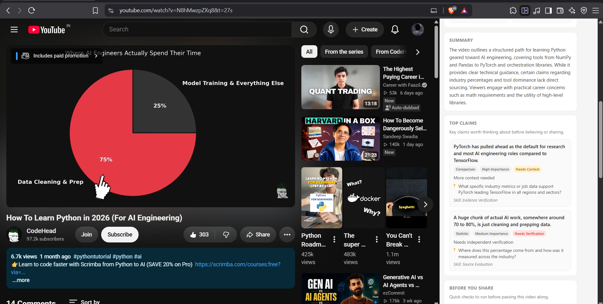
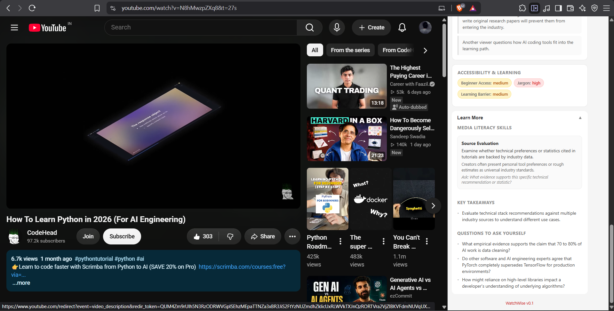
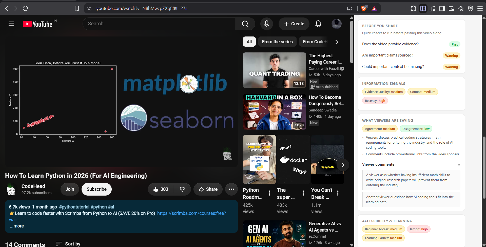

# WatchWise

> WatchWise is a Media and Information Literacy (MIL) browser extension that helps young people critically evaluate what they learn from YouTube before believing, sharing, or acting on it.


---

# Overview

Millions of young people use YouTube as a primary source of learning for technology, finance, science, and career development.

However, views, likes, and watch time do not help users evaluate whether information is accurate, complete, well-supported, or presented with sufficient context.

WatchWise is a Media and Information Literacy (MIL) browser extension that transforms everyday YouTube viewing into an opportunity for critical evaluation.

Instead of telling users what to think, WatchWise helps them ask the questions a critical thinker would:

- What claims is this video making?
- What evidence supports those claims?
- Could important context be missing?
- Is this statement fact, opinion, or interpretation?
- Should this information be verified before sharing?

By embedding these questions directly into the viewing experience, WatchWise helps users develop transferable media-literacy habits while consuming real-world content.

> Developed for the UNESCO Youth Hackathon 2026 under the theme:
> "Play Your Part: Youth Designing the Future of Media and Information Literacy."
---

# Features

- Key Claim Identification
- Verification Status (Supported / Needs Context / Needs Verification)
- Media Literacy Skill Mapping
- Critical Thinking Prompts
- Before You Share Checklist
- Community Perspective Analysis
- Outdated Information Detection
- Evidence Evaluation
- AI-generated Educational Summary
- Opinion vs Fact Analysis

---

# UNESCO Media & Information Literacy Alignment

WatchWise was designed around practical Media and Information Literacy competencies.

| WatchWise Feature | MIL Skill |
|-------------------|-----------|
| Top Claims | Evidence Verification |
| Verification Status | Source Evaluation |
| Critical Thinking Prompts | Context Awareness |
| Opinion vs Fact Analysis | Distinguishing Fact from Opinion |
| Community Perspective | Bias Recognition |
| Outdated Information Detection | Recency Checking |
| Before You Share Checklist | Responsible Information Sharing |

Rather than teaching MIL through standalone lessons, WatchWise embeds literacy skills directly into everyday online behavior.

---

# Architecture

```text
                    Chrome Extension
                            │
                            ▼
                     FastAPI Backend
                            │
                            ▼
                  SQLite Cache Lookup
                            │
                 ┌──────────┴──────────┐
                 │                     │
           Cache Hit              Cache Miss
                 │                     │
                 │          ┌──────────┴──────────┐
                 │          ▼                     ▼
                 │   YouTube Data API   YouTube Transcript API
                 │          │                     │
                 │          └──────────┬──────────┘
                 │                     ▼
                 │             Gemini AI Analysis
                 │                     │
                 │                     ▼
                 │          Store Result in Cache
                 │                     │
                 └──────────────┬──────┘
                                ▼
                    Recommendation Response
```

---

# Tech Stack

## Frontend

- Chrome Extension (Manifest V3)
- HTML
- CSS
- JavaScript

## Backend

- Python
- FastAPI
- Uvicorn

## Artificial Intelligence

- Google Gemini API

## Data Sources

- YouTube Data API
- YouTube Transcript API

## Database

- SQLite

---

# Project Structure

```text
WatchWise/
│
├── backend/
│   ├── core/
│   ├── models/
│   ├── routes/
│   ├── services/
│   ├── tests/
│   ├── main.py
│   └── requirements.txt
│   
│
├── extension/
│   ├── manifest.json
│   ├── popup.html
│   ├── popup.js
│   ├── options.html
│   ├── options.js
│   └── icons/
│
└──screenshots/
   ├── dashboard.png
   ├── top-claims.png
   ├── mil-skills.png
   └── before-share.png
```

---

# Installation

## Using the Hosted Backend (Recommended)

WatchWise is designed to work out of the box using the hosted backend. No Python installation or backend setup is required.

### Step 1: Clone the repository

```bash
git clone https://github.com/BhargavMalakonda/WatchWise.git
cd WatchWise
```

Alternatively, download the repository as a ZIP and extract it.

---

### Step 2: Load the Chrome Extension

1. Open Google Chrome.
2. Navigate to:

```
chrome://extensions
```

3. Enable **Developer Mode** (top-right corner).
4. Click **Load unpacked**.
5. Select the `extension/` folder from this repository.

The extension is now installed and ready to use.

By default, it connects to the hosted WatchWise backend automatically.

---

## Bring Your Own Gemini API Key (Optional)

WatchWise works without a personal Gemini API key by using the hosted backend's shared daily quota.

If the shared quota has been exhausted, or if you prefer to use your own Gemini API key:

1. Open the extension.
2. Click the **Settings** icon.
3. Select **My Gemini API Key**.
4. Generate a free API key from:

```
https://aistudio.google.com/apikey
```

5. Paste your API key and save.

Your API key:

- is stored only in your browser using `chrome.storage.local`
- is never logged
- is never stored on the server
- is used only for the current analysis request

---

# Self-Hosting (Optional)

Developers who want to run their own backend or contribute to WatchWise can self-host the FastAPI server.

## Backend Setup

Navigate to the backend directory.

```bash
cd backend
```

Create a virtual environment.

### Windows

```bash
python -m venv venv
venv\Scripts\activate
```

### macOS / Linux

```bash
python3 -m venv venv
source venv/bin/activate
```

Install the required dependencies.

```bash
pip install -r requirements.txt
```

Create a `.env` file inside the `backend/` directory.

```env
YOUTUBE_API_KEY=YOUR_YOUTUBE_API_KEY
GEMINI_API_KEY=YOUR_GEMINI_API_KEY
DEFAULT_DAILY_QUOTA=100
```
### Getting the required API Keys

#### YouTube Data API Key

Visit the **Google Cloud Console**:

   https://console.cloud.google.com/

#### Gemini API Key

Visit **Google AI Studio**:

   https://aistudio.google.com/apikey

Start the backend.

```bash
uvicorn main:app --reload
```

The backend will be available at:

```
http://localhost:8000
```

Interactive API documentation is available at:

```
http://localhost:8000/docs
```

---

## Using a Local Backend

If you are running your own backend:

1. Open the extension.
2. Click **Settings**.
3. Expand the **Advanced** section.
4. Change the Backend URL to:

```
http://localhost:8000
```

5. Save the settings.

The extension will now communicate with your locally hosted backend instead of the public WatchWise server.

---

# Screenshots

### Main Dashboard


### Top Claims


### MIL Skills


### Before You Share


---

# Demo

A short demonstration video of WatchWise is available here:

```
<https://www.youtube.com/watch?v=ClEz21Rn6sA>
```

---

# Security

WatchWise has been designed with security in mind.

- API keys are never logged.
- User-supplied Gemini API keys are never stored on the server.
- HTML is sanitized before analysis.
- Prompt injection attempts inside transcripts or comments are treated strictly as data.
- Rate limiting protects the backend against abuse.
- Cached analyses never contain user API keys or sensitive information.

---

# Privacy Policy

WatchWise respects user privacy.

## Information Processed

To analyze a YouTube video, the backend processes:

- Video URL
- Video transcript (when available)
- Public YouTube comments
- Optional user-supplied Gemini API key (only for the current request)

## Information Stored

The backend stores:

- Cached AI analysis results
- No personal user accounts
- No passwords
- No browsing history
- No user Gemini API keys

User-provided Gemini API keys are used only for the current analysis request and are never logged, persisted, cached, or shared.

---

# Contributing & Project Notes

Contributions are welcome! If you'd like to improve WatchWise:

1. Fork the repository.
2. Create a feature branch.
   ```bash
   git checkout -b feature/my-feature
   ```
3. Commit and push your changes.
4. Open a Pull Request with a clear description.

Before submitting, please ensure that:

- Existing functionality continues to work.
- Tests pass successfully.
- No API keys or sensitive information are committed.
- Documentation is updated when necessary.

### Current Limitations

WatchWise is an AI-assisted recommendation tool and should not be treated as an authoritative source.

Current limitations include:

- Supports **English transcripts only**.
- Videos without accessible transcripts cannot currently be analyzed.
- Long transcripts are **truncated** before AI analysis to improve performance and control API costs.
- Community insights are based on public YouTube comments and should be treated as supporting evidence rather than absolute truth.
- Important technical, financial, legal, or medical information should always be verified using official sources.

---

# Future Improvements

- Multi-language transcript and analysis support
- Browser-wide analysis beyond YouTube
- Chrome Web Store release
- Playlist and channel-level analysis
- Improved claim extraction and evidence evaluation
- Classroom and educator support features

---

# License

This project is licensed under the MIT License.

---

# Authors

### Malakonda Chaitanya Bhargav
- Backend Development
- AI Integration
- Product Design

GitHub: https://github.com/BhargavMalakonda
LinkedIn: <https://www.linkedin.com/in/chaitanya-bhargav-malakonda/>

### Kata Lekhana
- Research
- Proposal Development
- Testing & User Experience

GitHub: https://github.com/lekhanareddykata-blip
LinkedIn: <https://www.linkedin.com/in/lekhana-kata-b2b284323/>

---

If you find this project useful, consider giving it a star. Feedback, suggestions, and contributions are always welcome.
